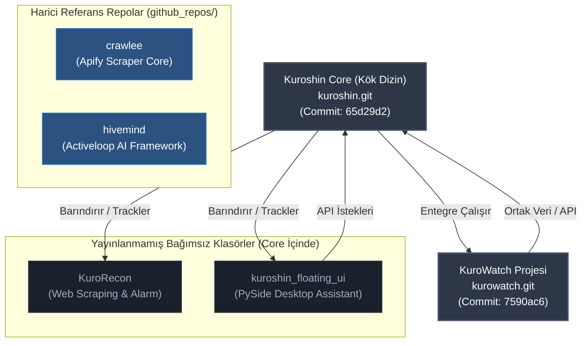

# 🔱 Kuroshin Proje Envanteri ve Repo Analizi

Bu belge, `C:\Kuroshin\` kök dizini altında bulunan tüm projelerin, alt klasörlerin ve entegrasyonların detaylı bir analizini sunar. Yerel dizinler taranmış, `.git` yapılandırmaları incelenmiş ve GitHub üzerindeki `KuroShinHQ` organizasyon yapısıyla karşılaştırmalı bir envanter oluşturulmuştur.

> [!NOTE]
> **Raporlama Tarihi:** 15 Temmuz 2026  
> **Kuroshin Core Commit:** `65d29d2`  
> **KuroWatch Commit:** `7590ac6`

---

## 📈 Özet İstatistikler

| Metrik | Değer | Açıklama |
| :--- | :--- | :--- |
| **Taranan Birincil Dizin Sayısı** | **29** | `C:\Kuroshin` altındaki tüm birinci seviye klasörler |
| **Bulunan `.git` Yapılandırması** | **4** | Kök dizin, KuroWatch ve `github_repos` altındaki 2 harici kütüphane |
| **GitHub'da Yayınlanmış Yerel Proje** | **2** | `kuroshin` (kök dizin) ve `kurowatch` |
| **Yayınlanmamış/Bağımsız Yerel Proje** | **2** | `KuroRecon` (scraper) ve `kuroshin_floating_ui` (PySide UI) |
| **Harici/Referans Dizin Sayısı** | **2** | `github_repos/crawlee` ve `github_repos/hivemind` |
| **Toplam Disk Boyutu (Analiz Edilen)** | **20.35 GB** | Dev boyutlu veri/model klasörleri dahil (`models`: 16.45 GB) |

### 🗺️ Mimari ve Depolama İlişki Şeması

---

## 1. 📌 GitHub Repoları (KuroShinHQ Entegrasyon Durumu)

Aşağıdaki tablo, `KuroShinHQ` organizasyonunda bulunan veya bulunması gereken projelerin yerel dizin eşleşmelerini ve aktif durumlarını göstermektedir:

| Repo Adı | Yerel Dizin | Durum | Tür | Açıklama |
| :--- | :--- | :--- | :--- | :--- |
| **kuroshin** | `C:\Kuroshin` (Kök) | **Private (Yayınlandı)** | Core / OS | Ana portfolyo, otonom agent servisleri, soul motoru ve MCP sunucuları. |
| **kurowatch** | `C:\Kuroshin\kurowatch` | **Private (Yayınlandı)** | Web / Takip | Anime/manga/manhwa takip, indirme ve izleme platformu (v1.2-STABLE). |
| **KuroShinHQ** | *Yok (Sadece Bulutta)* | **Public (Yayınlandı)** | Profil | GitHub organizasyon profili (README ve organizasyon detayları). |
| **KuroShinVM** | *Yok (Sadece Bulutta)* | **Private (Yayınlandı)** | Altyapı | Sanal makine ve donanım kontrol entegrasyon katmanı. |
| **AI-Model-Scanner**| *Yok (Sadece Bulutta)* | **Private (Yayınlandı)** | AI / Güvenlik | AI modellerinin güvenlik ve yapı analizini yapan tarayıcı. |
| **Kuroshin-CLI** | *Yok (Sadece Bulutta)* | **Private (Yayınlandı)** | CLI / AI | Token-Efficient LLM Trainer & Protocol Analysis aracı. |

---

## 2. ⚠️ Yerel ve Yayınlanmamış Projeler

Kök dizin içerisinde yer alan, `.git` klasörü doğrudan bulunmayan ancak mimari olarak **bağımsız birer proje/modül** niteliğinde olan klasörler:

### 🔍 KuroRecon (Fiyat Takip & Scraper Paketi)
* **Dizin Yolu:** [KuroRecon](file:///C:/Kuroshin/KuroRecon)
* **Klasör Boyutu:** `79.76 KB` (Kompres dosya ile birlikte `97.29 KB`)
* **Teknoloji Yığını:** Python 3.9+, Playwright, BeautifulSoup, Docker
* **Proje Türü:** Web Scraping / CLI / Otomasyon
* **Açıklama:** Sahibinden, Trendyol, Hepsiburada ve Epey gibi sitelerden anti-bot bypass entegrasyonu (curl_cffi) ile veri toplayan, alarm kuralları içeren bağımsız bir fiyat takip aracı. Dockerfile ve konfigürasyon yapısı hazırdır.
* **Öneri (Aksiyon):** **Ayrı Repo Olarak Yayınlanabilir (Yüksek Öncelik)**. `KuroRecon` adıyla private bir repo açılıp bu klasör bağımsız hale getirilebilir.

### 🎨 kuroshin_floating_ui (Desktop Floating Assistant)
* **Dizin Yolu:** [kuroshin_floating_ui](file:///C:/Kuroshin/kuroshin_floating_ui)
* **Klasör Boyutu:** `114.52 KB`
* **Teknoloji Yığını:** Python (PySide/PyQt), HTML/CSS/JS (Webview)
* **Proje Türü:** Desktop GUI / Masaüstü Arayüz
* **Açıklama:** Kuroshin otonom sisteminin masaüstünde çalışan, floating orb estetiğine sahip kullanıcı arayüzü. Core sistem ile API/Bridge üzerinden haberleşir.
* **Öneri (Aksiyon):** **Core Repoda Kalabilir / Ayrı Yayınlanabilir (Orta Öncelik)**. Bağımsız bir masaüstü uygulaması olarak `kuroshin-floating-ui` adıyla yayınlanması, kod temizliği açısından faydalı olacaktır.

### 📦 openclaude-main (OpenClaude Local Fork/Download)
* **Dizin Yolu:** [openclaude-main](file:///C:/Kuroshin/openclaude-main)
* **Klasör Boyutu:** `38.69 MB`
* **Teknoloji Yığını:** Node.js, TypeScript, Bun
* **Proje Türü:** Agent CLI / Üçüncü Parti Araç
* **Açıklama:** Açık kaynak kodlu OpenClaude projesinin yerel bir kopyası/forku. Otonom kodlama aracı olarak yerel modellerle çalışabilen bir CLI arayüzüdür.
* **Öneri (Aksiyon):** **Arşiv (Düşük Öncelik)**. Değişiklik yapılmıyorsa `archives/` dizinine taşınabilir veya geliştirme amacıyla `github_repos/` altına çekilerek git linki tanımlanabilir.

---

## 3. 📁 Harici Referans Repolar

`C:\Kuroshin\github_repos\` altında bulunan ve üçüncü parti kütüphanelerin kaynak kodlarını barındıran dizinler:

* **crawlee** ([github_repos/crawlee](file:///C:/Kuroshin/github_repos/crawlee))
  * **Uzak URL:** `https://github.com/apify/crawlee`
  * **Boyut:** `162.81 MB` (hivemind ile ortak)
  * **Açıklama:** Crawlee web scraping kütüphanesinin kaynak kodu. Kazıma altyapısı geliştirilirken referans olarak incelenmektedir.
* **hivemind** ([github_repos/hivemind](file:///C:/Kuroshin/github_repos/hivemind))
  * **Uzak URL:** `https://github.com/activeloopai/hivemind`
  * **Açıklama:** Merkezi olmayan makine öğrenimi ve veri akış kütüphanesi.

---

## 4. ⚙️ Kuroshin Sistem Dizinleri Envanteri

Kök repo olan `kuroshin` projesinin alt modülleri, sistem dizinleri ve çalışma alanlarının analizi:

| Dizin Adı | Dizin Boyutu | Tür | Açıklama / Görev | Öneri |
| :--- | :--- | :--- | :--- | :--- |
| **soul** | `53.69 KB` | **Core / Cognitive** | Kuroshin AI kişiliğinin otonom karar döngüsü ve rüya motoru (`dream_engine.py`, `idle_loop.py`). | **Koru (Dokunma)** |
| **agents** | `310.61 KB` | **Core / Service** | Chancellor, Walker ve Council servislerinin ana python dosyaları. | **Koru (Dokunma)** |
| **mcp_servers** | `94.53 KB` | **Core / MCP** | 8 adet yerel MCP sunucusu (bridge, search, walker, deerflow, litgpt vb.). | **Koru (Dokunma)** |
| **src** | `55.59 KB` | **Core / Source** | Core sistemin modüler Python kod yapısı. | **Koru (Dokunma)** |
| **config** | `1.52 KB` | **Core / Config** | Model sağlayıcıları (LiteLLM) ve trafik kontrol kuralları. | **Koru (Dokunma)** |
| **memory** | `69.35 MB` | **Core / Database** | Otonom sistemin hedefleri, görev geçmişi ve Qdrant/Mem0 yerel bellek veritabanı. | **Koru (Dokunma)** |
| **models** | `16.45 GB` | **AI / Models** | Yerel LLM modelleri (Qwen-30B Coder Instruct GGUF vb.). | **Koru (Dokunma)** |
| **kuroshin avatar vrm** | `21.19 MB` | **Assets / 3D** | Sistem avatarı VRoid ve VMD dosyaları (`Kuroshin.vrm`). | **Koru (Dokunma)** |
| **docs** | `30.58 MB` | **Documentation** | Sistem protokolleri, test planları ve devam durumu md dosyaları. | **Koru (Dokunma)** |
| **scripts** | `3.72 MB` | **Utilities** | Veri migrasyonu, temizlik ve entegrasyon betikleri. | **Koru (Düzenle/Temizle)** |
| **tests** | `14.19 KB` | **Testing** | Entegrasyon test suite dosyaları. | **Koru** |
| **tools** | `155.32 MB` | **Binaries / Tools** | `gh.exe`, `tailwindcss.exe` ve crawlee entegrasyon node_modules klasörü. | **Koru** |
| **archives** | `21.03 MB` | **Backup** | Eski otonom betikler ve kaldırılmış modüllerin arşivi. | **Arşivde Tut** |
| **backups** | `1010.87 MB` | **Backup** | Kök dizinin `.zip` ve `.7z` sıkıştırılmış tam yedekleri. | **Harici Diske Taşı / Temizle** |
| **backup** | `34.29 KB` | **Temp / Backup** | `ai-town-main` yedek klasörü. | **Temizle / Arşive Taşı** |
| **kuroshin-downloads** | `2.33 GB` | **Cache / Temp** | İndirilen büyük dosyalar ve model yedekleri (`gemma-3-4b-it-Q4_K_M.gguf`). | **Temizle** |
| **logs** | `14.15 MB` | **Logs** | Otonom çalışma logları, hata çıktıları. | **Log Rotasyonu Yap** |
| **temp** | `9.41 KB` | **Temp** | Geçici test scriptleri. | **Temizle** |
| **storage** | `11.78 KB` | **Temp / State** | Crawlee kuyrukları ve geçici durumlar. | **Güvenli Temizle** |
| **.obsidian** | `7.67 KB` | **Workspace** | Obsidian not tutma aracı konfigürasyonları. | **Koru** |

---

## 🚀 Önerilen Yol Haritası ve Aksiyon Adımları

### 1. `KuroRecon` Projesinin Ayrılması
`KuroRecon` tamamen bağımsız çalışabilen bir scraping paketidir. Core repo şişkinliğini azaltmak ve daha modüler bir yönetim için:
1. `KuroRecon` adıyla private bir GitHub reposu oluşturulmalı.
2. Yerel `C:\Kuroshin\KuroRecon` klasörü bu repoya push edilmeli.
3. Core repodaki (`C:\Kuroshin\.gitignore`) dosyasına `/KuroRecon/` eklenerek core izlemesinden çıkarılmalı (ya da git submodule olarak eklenmeli).

### 2. `kuroshin_floating_ui` Modülünün Ayrılması
Masaüstü orb arayüzü olan bu modülün bağımsızlığı için:
1. `kuroshin-floating-ui` adıyla private bir repo kurulmalı.
2. Kod tabanı buraya aktarılmalı ve bağımsız bir release pipeline tanımlanmalı.

### 3. Disk Hijyeni ve Temizlik Aksiyonları
Disk üzerinde yer kaplayan geçici/yedek veriler için:
* `backups/` altında yer alan `KUROSHIN_ULTIMATE_BACKUP_20260425.zip` ve benzeri eski yedekler (yaklaşık 1 GB) harici bir depolama birimine taşınmalı veya silinmeli.
* `kuroshin-downloads/` içerisindeki eski model ağırlıkları temizlenmeli (2.33 GB kazanç sağlar).
* `temp/` ve `storage/` altındaki çöp dosyalar silinmeli.
